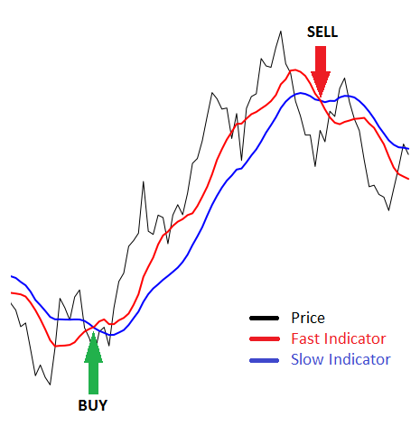

#### Alexey Serdyuk
#### May 2019

# Algorithmic trading

This is a course project for the course "Developing Data Products" offered by
[Coursera](https://www.coursera.org/learn/data-products).

One of the major applications of the data science is analysis of stock markers.
According to many researchers, as of the end 2018 [up to 80% of all trades on
stock markers are executed by algorithms](https://www.cnbc.com/2018/12/05/sell-offs-could-be-down-to-machines-that-control-80percent-of-us-stocks-fund-manager-says.html). Still it is up to humans
to define such algorithms.

This application implements a simple trend-following algorithm and allows you
to investigate an impact of various parameters on a revenue. Are you able to
tune the algorithm to beat the market?

# Usage

This section just describes the controls. If you are interested in how the
algorithm actually works, read the next section.

* Choose the market index or stock to trade in the drop-down box.
You may choose either [German market index DAX](https://en.wikipedia.org/wiki/DAX)
or any of 30 stocks included into the DAX.

* Use sliders to choose time period for fast and slow trend indicators.

* Choose functions to calculate fast and slow trend indicators. You may start
with SMA (simple moving average) or EMA (exponential moving average) covered by
Coursera lectures, and later try other indicators.

In the right panel you will find results of the algorithm applied to historical
market prices:

* The upper chart shows historical prices, fast and slow indicators. The chart
also shows "buy / sell" markers where trades were generated.

* The lower chart shows capital development as percentage of the initial capital.
The dark-blue line indicates a linear regression. Your goal is to tune parameters
of the algorithm so that the regression line rises as steep as possible, maximizing
your profit.

* The table below the chart contains most important results, such as how often
the algorithm trades, or the annualized rate of return.

* The last table shows all trades generated by the algorithm.

# Fast/slow trend trading algorithm

The implemented algorithm is based on the idea that stock prices tend to follow
a trend (going up or down) for a relatively long time before changing direction.
Of course, prices are pretty chaotic, so trends may be hidden behind cycles and
random noise. Our goal is to recognize the trends and follow them. For example,
if we anticipate a positive trend, that is rising prices, we will buy stocks
in a hope to sell them later at a higher price.

In order to recognize trends, we will calculate two functions (indicators) based
on stock price. Both indicators smooth price to remove random noise. The first
indicator follows price relatively close (fast indicator), the other lags behind
(slow indicator). Whenever the fast indicator is above the slow indicator, we
consider this to predict an up-trend, that is rising prices, and open a
[long position](https://en.wikipedia.org/wiki/Long_(finance\)). On the other
hand, if the fast indicator is below the slow indicator, we expect a down-trend,
that is falling prices, and open a [short position](https://en.wikipedia.org/wiki/Short_(finance\)).

Unfortunately there is no silver bullet, that is no obviously optimal settings
for a fast / slow indicators. If an indicator follows price too close, it keeps
some of the random noise present in the price, generating many whipsaw trades
and losing you money. On the other hand, if the indicator is smooth enough to
exclude all the random noise, it falls behind the price too much. As a result,
when the trend changes direction, you may loose a lot money before the indicator
"notices" the change.

Using this application, you have an opportunity to find profitable parameters
without risking your money.

# A word of caution

Please take into account that this application implements a simplified algorithm
which ignores many important factors. For example, on a real market you have to
pay your broker a commission for each trade, reducing your profits.

This application is just a demonstration of the algorithm, it can not replace
you a financial adviser.

**Please do not use this application as a base for your investment decisions!**
